# FOS Backend Class Diagram (Important Classes Only)

This diagram intentionally focuses on the high-impact classes that define architecture and runtime behavior. DTOs, request/response records, enum types, and simple repositories/adapters with low architectural weight are mostly omitted.

## High-Level Class Diagram

```mermaid
classDiagram
    class Gateway_GatewayRoutesConfig
    class Gateway_SecurityConfig
    class Gateway_ActorIdEnrichmentFilter
    class Gateway_CorrelationIdFilter

    class Governance_SignalIntakeController
    class Governance_SignalProcessingService
    class Governance_SignalHandler
    class Governance_SchemaValidationHandler
    class Governance_KafkaRoutingHandler
    class Governance_NotificationFanOutHandler
    class Governance_PolicyEvaluationController
    class Governance_PolicyEvaluationService
    class Governance_OpaEvaluator
    class Governance_OpaClient
    class Governance_ActorService
    class Governance_PlayerService
    class Governance_TeamService

    class Workspace_DocumentController
    class Workspace_DocumentService
    class Workspace_WorkspaceDocument
    class Workspace_WorkspaceDocumentRepository
    class Workspace_EventController
    class Workspace_EventService
    class Workspace_WorkspaceEvent
    class Workspace_EventReminderScheduler
    class Workspace_PlayerProfileController
    class Workspace_PlayerProfileService
    class Workspace_NotificationController
    class Workspace_NotificationService
    class Workspace_WorkspaceKafkaConsumer
    class Workspace_SearchController
    class Workspace_WorkspaceSearchService
    class Workspace_OnlyOfficeController
    class Workspace_OnlyOfficeConfigService
    class Workspace_OnlyOfficeSaveHandler

    class SDK_SignalEnvelope
    class SDK_FosKafkaProducer
    class SDK_AbstractFosConsumer
    class SDK_PolicyClient
    class SDK_StoragePort
    class SDK_FosSecurityContext
    class SDK_CanonicalRef
    class SDK_CanonicalResolver
    class SDK_BaseDocument

    Governance_SignalIntakeController --> Governance_SignalProcessingService
    Governance_SignalProcessingService --> Governance_SignalHandler
    Governance_SchemaValidationHandler --|> Governance_SignalHandler
    Governance_KafkaRoutingHandler --|> Governance_SignalHandler
    Governance_NotificationFanOutHandler --|> Governance_SignalHandler
    Governance_KafkaRoutingHandler --> SDK_FosKafkaProducer
    Governance_SignalHandler --> SDK_SignalEnvelope

    Governance_PolicyEvaluationController --> Governance_PolicyEvaluationService
    Governance_PolicyEvaluationService --> Governance_OpaEvaluator
    Governance_OpaEvaluator --> Governance_OpaClient

    Governance_ActorService --> SDK_FosKafkaProducer
    Governance_PlayerService --> SDK_FosKafkaProducer
    Governance_TeamService --> SDK_FosKafkaProducer

    Workspace_DocumentController --> Workspace_DocumentService
    Workspace_DocumentService --> Workspace_WorkspaceDocumentRepository
    Workspace_DocumentService --> Workspace_WorkspaceDocument
    Workspace_DocumentService --> SDK_StoragePort
    Workspace_DocumentService --> SDK_PolicyClient
    Workspace_DocumentService --> SDK_FosKafkaProducer
    Workspace_DocumentService --> SDK_FosSecurityContext

    Workspace_EventController --> Workspace_EventService
    Workspace_EventService --> Workspace_WorkspaceEvent
    Workspace_EventService --> SDK_PolicyClient
    Workspace_EventService --> SDK_FosKafkaProducer
    Workspace_EventService --> SDK_FosSecurityContext
    Workspace_EventReminderScheduler --> Workspace_WorkspaceEvent

    Workspace_PlayerProfileController --> Workspace_PlayerProfileService
    Workspace_PlayerProfileService --> Workspace_WorkspaceDocumentRepository
    Workspace_PlayerProfileService --> SDK_CanonicalResolver
    Workspace_PlayerProfileService --> SDK_PolicyClient
    Workspace_PlayerProfileService --> SDK_StoragePort

    Workspace_NotificationController --> Workspace_NotificationService
    Workspace_NotificationService --> SDK_FosSecurityContext
    Workspace_WorkspaceKafkaConsumer --|> SDK_AbstractFosConsumer

    Workspace_SearchController --> Workspace_WorkspaceSearchService
    Workspace_WorkspaceSearchService --> Workspace_WorkspaceDocumentRepository
    Workspace_WorkspaceSearchService --> SDK_PolicyClient
    Workspace_WorkspaceSearchService --> SDK_StoragePort

    Workspace_OnlyOfficeController --> Workspace_OnlyOfficeConfigService
    Workspace_OnlyOfficeController --> Workspace_OnlyOfficeSaveHandler
    Workspace_OnlyOfficeConfigService --> Workspace_WorkspaceDocumentRepository
    Workspace_OnlyOfficeConfigService --> SDK_PolicyClient
    Workspace_OnlyOfficeConfigService --> SDK_StoragePort
    Workspace_OnlyOfficeConfigService --> SDK_FosSecurityContext
    Workspace_OnlyOfficeSaveHandler --> Workspace_WorkspaceDocumentRepository
    Workspace_OnlyOfficeSaveHandler --> SDK_FosKafkaProducer

    Workspace_WorkspaceDocument --|> SDK_BaseDocument
    Workspace_WorkspaceEvent --|> SDK_BaseDocument
    Workspace_WorkspaceDocument --> SDK_CanonicalRef
    Workspace_WorkspaceEvent --> SDK_CanonicalRef
```

## What Each Included Class Does

### Gateway

- `GatewayRoutesConfig`: central API router; maps `/api/v1/*` paths to governance/workspace services.
- `SecurityConfig`: enforces gateway JWT authentication (with health endpoint exception and local disable flag).
- `ActorIdEnrichmentFilter`: injects `X-FOS-Actor-Id` from JWT subject into downstream requests.
- `CorrelationIdFilter`: guarantees each request has `X-FOS-Request-Id` for tracing.

### Governance - Signal and Policy Core

- `SignalIntakeController`: ingress endpoint for signals (`POST /api/v1/signals`).
- `SignalProcessingService`: executes the full signal pipeline.
- `SignalHandler`: chain-of-responsibility base for signal handlers.
- `SchemaValidationHandler`: rejects invalid signals early (missing type/topic/actorRef).
- `KafkaRoutingHandler`: publishes validated signals to Kafka through SDK producer.
- `NotificationFanOutHandler`: fans out ALERT signals to notification port/adapters.
- `PolicyEvaluationController`: API entrypoint for authorization checks.
- `PolicyEvaluationService`: thin application service delegating policy decisions.
- `OpaEvaluator`: builds OPA input context and interprets allow/deny decision.
- `OpaClient`: HTTP client that calls OPA (`/v1/data/fos/allow`).

### Governance - Identity and Canonical Domain Services

- `ActorService`: manages actor lifecycle (create/update/deactivate/sync Keycloak) and emits identity FACT signals.
- `PlayerService`: manages canonical players and emits canonical FACT signals.
- `TeamService`: manages canonical teams and emits canonical FACT signals.

### Workspace - Documents, Events, Profiles

- `DocumentController`: HTTP API for document upload/initiate/confirm/read/list/delete.
- `DocumentService`: core document business flow (policy checks, presigned upload, versioning, audit/fact signals).
- `WorkspaceDocument`: aggregate root for workspace documents and version history.
- `WorkspaceDocumentRepository`: Mongo access for document persistence and search by name/category/state.
- `EventController`: HTTP API for event CRUD/list.
- `EventService`: event lifecycle + policy checks + event signal emission.
- `WorkspaceEvent`: aggregate root for events, attendees, tasks, required docs, reminder state.
- `EventReminderScheduler`: scheduled reminder scanner for upcoming events.
- `PlayerProfileController`: profile endpoint for player workspace view.
- `PlayerProfileService`: builds role-filtered player profile tabs (documents/reports/medical/admin).

### Workspace - Notifications, Search, OnlyOffice

- `NotificationController`: inbox endpoints (list, unread count, mark read, mark all read).
- `NotificationService`: actor-scoped notification retrieval and read-state updates.
- `WorkspaceKafkaConsumer`: consumes workspace Kafka topics and persists user notifications.
- `SearchController`: search endpoint for workspace content.
- `WorkspaceSearchService`: searches documents/events and filters document results by policy.
- `OnlyOfficeController`: endpoints for editor config generation and save callback handling.
- `OnlyOfficeConfigService`: validates access/mode and builds signed OnlyOffice editor config.
- `OnlyOfficeSaveHandler`: handles callback save flow and appends a new document version.

### SDK Foundation (Cross-Cutting Contracts)

- `SignalEnvelope`: standard event/signal contract shared across services.
- `FosKafkaProducer`: Kafka publisher decorator adding correlation ID + timestamp.
- `AbstractFosConsumer`: template-method base for reliable consumer behavior.
- `PolicyClient`: SDK remote client for governance policy evaluation.
- `StoragePort`: storage abstraction used by workspace services (MinIO/S3/Azure adapters behind it).
- `FosSecurityContext`: standardized way to get actor/role from JWT in service code.
- `CanonicalRef`: typed reference to canonical entities (`PLAYER`, `TEAM`, `CLUB`).
- `CanonicalResolver`: caching proxy for canonical lookups.
- `BaseDocument`: shared Mongo aggregate base (`resourceId`, state machine, auditing).

## Exclusion Rule Used

I excluded low-importance classes for readability: simple DTOs, request/response records, migration classes, enums, and most narrow adapters/repositories unless they are central to architecture.
